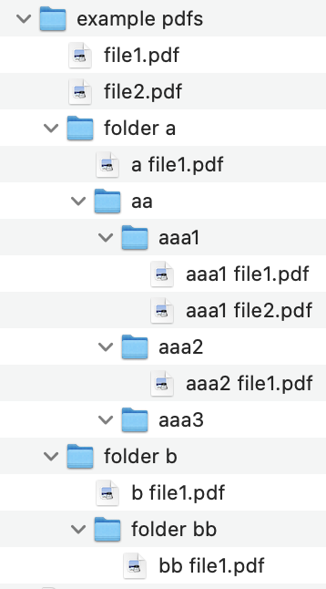
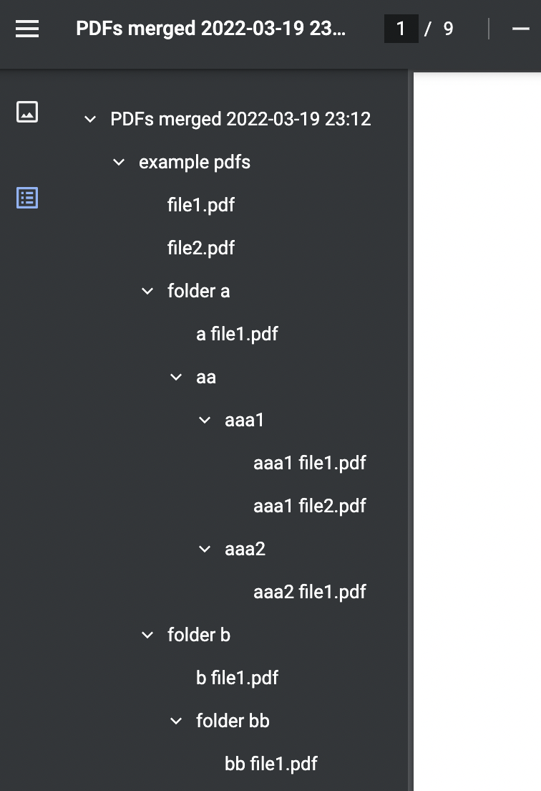

# pdfmb
Merge PDF files with bookmarks

<p float="left">


</p>


## Installation
You can install this package via pip.
```
pip install pdfmb
```

## Usage
```python
from pathlib import Path
import pdfmb
```

```python
pdfmb.merge(
    pdfs_to_merge=Path("example pdfs").rglob("*.pdf"),
    output_folder=Path("output"),
)
```

```python
pdfmb.add(
    pdfs_to_add=Path("example pdfs").rglob("*.pdf"),
    existing_pdf=Path("example pdfs/file1.pdf"),
)
```

```python
pdfmb.merge_from_folder(
    source_folder=Path("example pdfs"),
    output_folder=Path("output"),
)
```

```python
pdfmb.add_from_folder(
    source_folder=Path("example pdfs"),
    existing_pdf=Path("example pdfs/file1.pdf"),
    add_flat_hierachy=True,
)

```